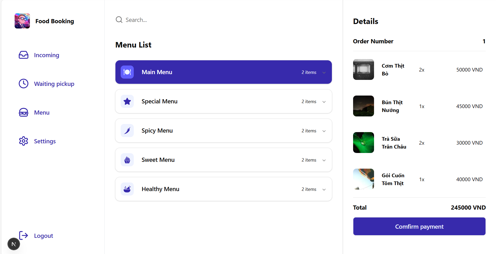

# Hệ Thống Đặt Bàn & Gọi Món Nhà Hàng




## Giới Thiệu

Hệ thống đặt bàn và gọi món trực tuyến dành cho nhà hàng, giúp khách hàng dễ dàng đặt bàn, xem thực đơn và đặt món trực tuyến. Ứng dụng được xây dựng bằng Next.js với kiến trúc App Router mới nhất.

## Tính Năng Chính

- 🍽️ Đặt bàn trực tuyến
- 📱 Xem thực đơn với hình ảnh món ăn
- 🛒 Thêm món vào giỏ hàng
- 🔐 Xác thực người dùng
- 📱 Giao diện đáp ứng trên mọi thiết bị

## Công Nghệ Sử Dụng

- **Frontend**: Next.js 14, React 18, TypeScript
- **UI Components**: Radix UI, Tailwind CSS
- **Quản lý State**: React Hook Form, Zustand
- **Xác thực**: NextAuth.js
- **Tích hợp API**: Axios

## Yêu Cầu Hệ Thống

- Node.js 18.x trở lên
- npm hoặc yarn
- Git

## Cài Đặt

1. **Clone dự án**
   ```bash
   git clone [repository-url]
   cd fe_food_reservation
   ```

2. **Cài đặt dependencies**
   ```bash
   npm install
   # hoặc
   yarn install
   ```

3. **Tạo file .env**
   Tạo file `.env` từ `.env.example` và cập nhật các biến môi trường cần thiết.

4. **Chạy dự án**
   ```bash
   npm run dev
   # hoặc
   yarn dev
   ```

5. **Truy cập ứng dụng**
   Mở trình duyệt và truy cập [http://localhost:3000](http://localhost:3000)

## Cấu Trúc Dự Án

```
fe_food_reservation/
├── app/                    # Thư mục chính của ứng dụng
│   ├── (auth)/             # Các route xác thực
│   ├── (main)/             # Các route chính
│   ├── api/                # API routes
│   └── dashboard/          # Trang quản trị
├── components/             # Các component tái sử dụng
│   ├── cart/               # Component giỏ hàng
│   ├── navigation/         # Thanh điều hướng
│   └── ui/                 # UI components
├── lib/                    # Các tiện ích
├── public/                 # Tài nguyên tĩnh
├── schema/                 # Schema validation
├── store/                  # Global state management
└── types/                  # TypeScript type definitions
```

## Hướng Dẫn Phát Triển

### Quy Tắc Commit

Chúng tôi sử dụng [Conventional Commits](https://www.conventionalcommits.org/) cho các thông điệp commit. Ví dụ:

```
feat: thêm chức năng đặt bàn
fix: sửa lỗi thanh toán
chore: cập nhật dependencies
```

### Tạo Pull Request

1. Tạo một branch mới từ `main`
2. Commit các thay đổi của bạn
3. Push branch lên remote repository
4. Tạo Pull Request với mô tả rõ ràng về các thay đổi

## Giấy Phép

Dự án này được cấp phép theo giấy phép MIT - xem file [LICENSE](LICENSE) để biết thêm chi tiết.

## Liên Hệ

- Tác giả: [Tên của bạn]
- Email: [email của bạn]
- GitHub: [tên người dùng GitHub của bạn]

## Cảm Ơn

Cảm ơn bạn đã quan tâm đến dự án này! Nếu bạn thấy dự án hữu ích, đừng ngần ngại để lại một ⭐️ trên GitHub.
